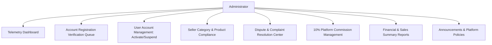

# Administrator Module Specification & Governance Flow

This document details the administrative control center, verification workflows, 10% commission calculations, dispute resolution, and compliance mechanisms.

---

## 1. Admin Functional Overview

---

## 2. Registration Approval Queue (KYC Verification)

Admin must verify applicants before they can log in:

1. **Buyer Verification:**
   - Inspect Name, Contact Number, Address, and uploaded Government ID image.
   - Action: `Approve` (Status becomes `active`) or `Disapprove` (Provide reason, dispatch email).
2. **Seller Verification:**
   - Inspect Business Name, Registered Line of Business Category, Government ID, and uploaded Business Permit (DTI/Mayor's Permit).
   - Action: `Approve` or `Disapprove`.
3. **Courier Verification:**
   - Inspect Vehicle Type, Plate Number, Driver's License, and OR/CR document.
   - Action: `Approve` or `Disapprove`.

---

## 3. Seller Compliance & Product Moderation

- **Category Verification:** Ensure products listed by a seller fall strictly under their approved registered line of business (category).
- **Prohibited Product Removal:** Immediate takedown button for flagged or counterfeit listings.
- **Enforcement Actions:**
  - Issue official warning to merchant.
  - Suspend merchant account (hides all active listings from the marketplace).

---

## 4. Dispute & Complaint Resolution

- **Tripartite Mediation:** Handles disputes between Buyers, Sellers, and Couriers (e.g. damaged goods, missing items, delivery delays).
- **Evidence Review:** View uploaded complaint evidence photos, order details, courier logs, and message history.
- **Resolution Outcomes:**
  - Issue full / partial refund to Buyer.
  - Settle payout to Seller.
  - Penalize courier or seller for negligence.

---

## 5. Platform Commission Engine (10%)

- On every successful order completion:
  - System automatically calculates **$10\%$ Platform Commission** from the item subtotal.
  - $90\%$ is credited to the Seller's store ledger.
  - $100\%$ of the Delivery Fee is credited to the Courier.
- **Auditing & Reporting:**
  - Generate Commission Reports filtered by date range (`from_date` to `to_date`).
  - Total Platform Commission Collected, Total Seller Payouts, Total Gross Transaction Volume.
