# Buyer-Side Process Flowchart & Lifecycle Diagram

This document presents the complete visual process flow for the **Buyer Module** of the platform as mandated by the project activity specifications.

---

## Buyer Lifecycle Flowchart (Mermaid)

```mermaid
flowchart TD
    START([START]) --> DecisionEntry{Already have an account?}

    %% REGISTRATION BRANCH
    DecisionEntry -- No --> RegPage[Open Registration Page]
    RegPage --> InputRegDetails[Enter: Last Name, First Name, MI, Sex, Email, Contact No, Birthday, Age, Address via API Dropdown]
    InputRegDetails --> UploadID[Upload Government / Valid ID]
    UploadID --> SubmitReg[Submit Registration Application]
    SubmitReg --> PendingApproval[Account Status: PENDING_APPROVAL]
    PendingApproval --> AdminReview[Admin Reviews Identification & Information]
    AdminReview --> AdminDecision{Admin Approved?}
    AdminDecision -- Rejected --> NotifyReject[Receive Disapproval Email with Reason]
    NotifyReject --> RegPage
    AdminDecision -- Approved --> NotifyApprove[Receive Approval Notification Email]
    NotifyApprove --> LoginPage

    %% LOGIN BRANCH
    DecisionEntry -- Yes --> LoginPage[Open Login Page]
    LoginPage --> InputCredentials[Enter Email & Password]
    InputCredentials --> CheckCreds{Valid Credentials & Approved?}
    CheckCreds -- Invalid Password / Email --> LoginError[Display Error: Invalid Credentials]
    LoginError --> LoginPage
    CheckCreds -- Account Still Pending --> PendingNotice[Display Notice: Awaiting Admin Approval]
    PendingNotice --> LoginPage
    CheckCreds -- Approved & Valid --> MainMenu[Enter Marketplace Main Menu]

    %% BROWSE / SEARCH / PRODUCT VIEW
    MainMenu --> NavAction{Choose Action}
    NavAction --> ViewCategories[Browse by Category & Subcategories]
    NavAction --> SearchBar[Search Products by Keywords / Filters]
    ViewCategories --> ProductList[View Product Grid]
    SearchBar --> ProductList
    ProductList --> ViewProduct[Select & Open Product Details Page]
    ViewProduct --> ChooseVariations[Select Product Variations: Color, Size, Specs]
    ChooseVariations --> SelectQty[Select Quantity within Stock Limit]
    SelectQty --> AddToCart[Click 'Add to Bag']
    AddToCart --> ContinueShopping{Continue Shopping?}
    ContinueShopping -- Yes --> MainMenu
    ContinueShopping -- No --> ViewCart[Open Shopping Bag Page]

    %% CART & CHECKOUT
    ViewCart --> ReviewCartItems[Review Selected Items & Quantities]
    ReviewCartItems --> ApplyVoucher{Have Promo Voucher?}
    ApplyVoucher -- Yes --> EnterVoucherCode[Enter Voucher Code & Apply Discount]
    EnterVoucherCode --> FinalizeOrder[Finalize Order Subtotal & Delivery Details]
    ApplyVoucher -- No --> FinalizeOrder
    FinalizeOrder --> SelectPayment[Choose Payment Mode: COD / Card / Bank / E-Wallet]
    SelectPayment --> PlaceOrder[Click 'Place Order']
    PlaceOrder --> OrderCreated[Order Record & Delivery Shipment Initialized]

    %% POST-ORDER & TRACKING
    OrderCreated --> ViewOrderStatus[View Live Order Status & Tracking Timeline]
    ViewOrderStatus --> StatusMilestones{Delivery Milestone}
    StatusMilestones --> M1[Packaging by Merchant]
    M1 --> M2[Ready for Courier Pickup]
    M2 --> M3[Picked Up & In Transit]
    M3 --> M4[Out for Delivery]
    M4 --> M5[Delivered to Doorstep]
    M5 --> RateFeedback[Submit Product Rating 1-5 Stars & Feedback Review]

    %% ACCOUNT, CHAT & LOGOUT
    RateFeedback --> AccountHub[Account Management Hub]
    MainMenu --> ChatAction[In-App Chat / Messaging with Seller & Courier]
    MainMenu --> AccountHub
    ChatAction --> AccountHub
    AccountHub --> LogoutAction[Click 'Sign Out']
    LogoutAction --> END([END / Session Terminated])
```

---

## Buyer Flow Functional Checklist

- [x] **Registration Included:** Capture full name, sex, email, contact, birthday, autogen age, cascading address dropdowns, and ID upload.
- [x] **Admin Approval Represented:** Mandatory admin approval gate before login access.
- [x] **Login & Validation:** Credential check + approval status verification.
- [x] **Main Menu & Catalog:** 14 Master categories, keyword search, dynamic sorting.
- [x] **Product Details & Variants:** Color, size, stock boundaries, and quantity selection.
- [x] **Cart & Checkout Engine:** Voucher discounts, payment selection (COD, Card, Transfer), instant dispatch initialization.
- [x] **Live Tracking Milestones:** Multi-stage shipment tracking from packaging to delivery.
- [x] **Rating & Feedback:** Review submissions post-delivery.
- [x] **In-App Messaging & Account Settings:** Direct buyer-to-seller/courier chat.
