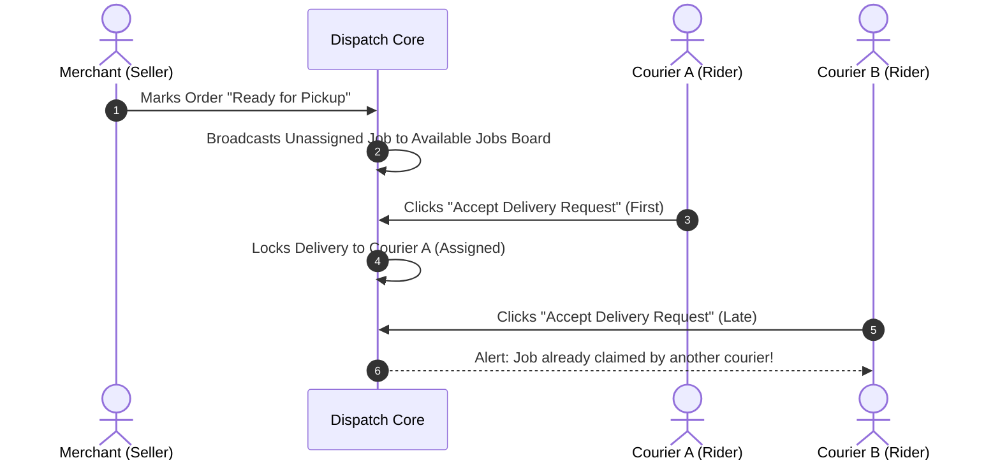

# 🚚 Courier & Logistics Module Specification & Flow

This document details the complete operational lifecycle, dispatch algorithms, and task execution for Couriers and Logistics Partners.

---

## 📝 1. Courier Registration & Verification

1. **Required Input Fields:**
   - **Personal:** Last Name*, First Name*, Middle Initial, Sex*, Email*, Contact No.*, Birthday*, Age (auto-generated)*.
   - **Address:** Province (Dropdown API), Municipality/City (Dropdown API), Barangay (Dropdown API), Street & House No. (Manual Entry).
   - **Vehicle Details:** Vehicle Type (Motorcycle, Van, Bicycle, Truck)*, Vehicle Plate Number*.
   - **Verification Documents:** Upload Official Receipt / Certificate of Registration (OR/CR)*, Upload Driver's License / Valid Government ID*.
2. **State Transition:**
   - Account starts as `pending_approval` until Admin validates driver credentials.

---

## ⚡ 2. First-Come, First-Served Dispatch Engine

---

## 🛣️ 3. Delivery Execution Workflow

1. **Step 1: Accept Request:**
   - Courier reviews pickup distance, merchant address, destination address, and package details.
2. **Step 2: Proceed to Store & Confirm Pickup:**
   - Courier arrives at store address -> Verifies physical parcel matches Order Number -> Clicks `Confirm Item Pickup`.
   - Status updates to `Picked Up` and order status updates to `Shipped`.
3. **Step 3: En Route & Transit:**
   - Status transitions to `In Transit` and `Out for Delivery`.
4. **Step 4: Doorstep Delivery & Proof of Drop-off:**
   - Courier delivers parcel to buyer -> Takes drop-off proof image / enters customer note -> Clicks `Complete Delivery`.
   - Payment collected (if COD) and delivery settled.

---

## 💵 4. Courier Earnings & Analytics

- **Profit / Earnings Page:**
  - Real-time earnings summary (total payouts per completed delivery).
  - Delivery trip history log with timestamps, tracking numbers, and addresses.
  - Active duty toggle (`Available` vs `Off Duty`).
- **In-App Messaging:**
  - Direct calling/chatting with Seller (for pickup coordination) and Buyer (for destination directions).
