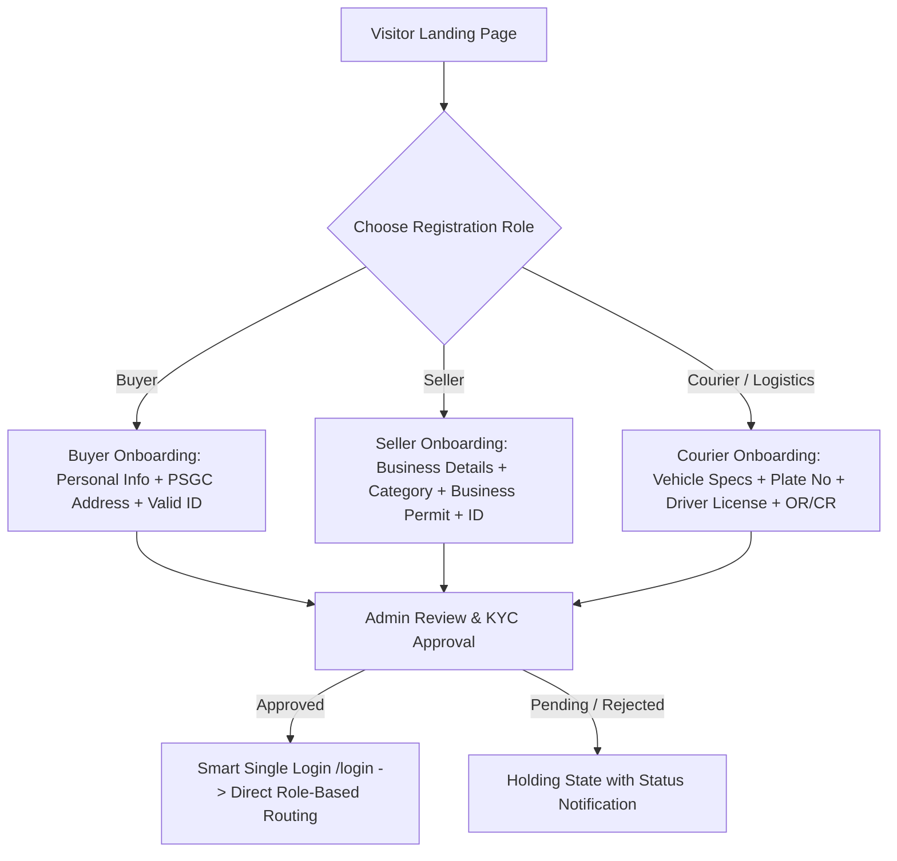
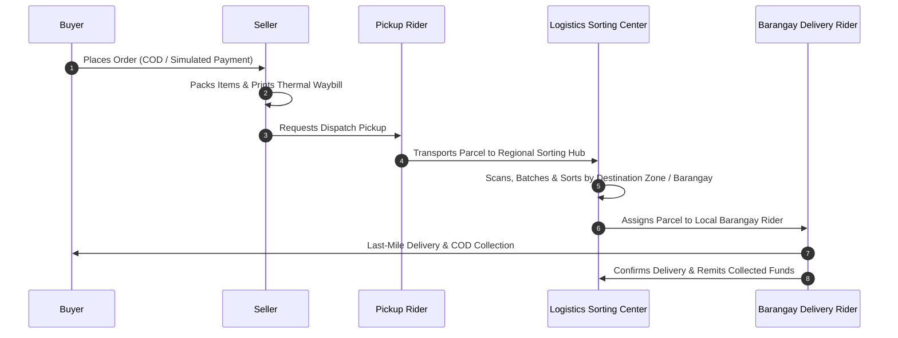
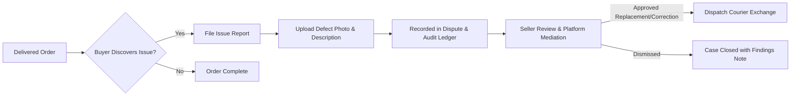

# BagooPH - Master Project Plan & System Architecture

> **Executive Overview:**
> BagooPH ("Bag & Go") is an enterprise multi-role e-commerce and logistics ecosystem built for the Philippine market. It seamlessly interconnects Buyers, Sellers, Logistics Sorting Hubs / Couriers, and Platform Administrators in a single, high-performance architecture.

---

## 1. Multi-Role Identity & Independent Onboarding



### Key Principles:
1. **Independent Registration Paths:** Sellers can register and operate directly as verified merchants without needing an active buyer account first.
2. **Mandatory KYC Verification:** All roles require administrator document verification before accessing transactional portals.
3. **Unified Login (`/login`):** A single login gateway dynamically routes authenticated sessions to their respective cockpit (`/buyer`, `/seller/dashboard`, `/courier/deliveries`, or `/admin/dashboard`).

---

## 2. Logistics, Sorting Center & GIS Fleet Architecture



### Sorting Center & Rider Mechanics:
1. **Two-Tier Delivery Chain:**
   * **Stage 1 (First-Mile):** Pickup rider collects parcels from merchant locations and transports them to the regional Logistics Sorting Center.
   * **Stage 2 (Hub Sorting):** Sorting center scans barcodes, updates status to *In Sorting Hub*, and clusters packages by destination municipality and barangay.
   * **Stage 3 (Last-Mile):** Sorting center assigns clustered parcels to specific courier riders assigned to that particular Barangay / Delivery Zone.
2. **GIS / Proximity-Based Fleet Matching:**
   * Parcels are routed to the nearest operational sorting facility based on geographic coordinates and PSGC address hierarchy.
   * Ensures merchant dispatch connects to the optimal logistics hub in their territory.

---

## 3. Financial Architecture, Fees & Commission Ledger

```
+-------------------------------------------------------------------------------+
|                             TOTAL TRANSACTION VALUE                           |
+------------------------------------+------------------------------------------+
|          PRODUCT SUB-TOTAL         |               SHIPPING FEE               |
+------------------+-----------------+---------------------+--------------------+
| Merchant Payout  | 10% Platform    | Logistics Sorting   | Last-Mile Courier  |
| (90% of Items)   | Commission      | Hub Revenue Share   | Rider Revenue Share|
+------------------+-----------------+---------------------+--------------------+
```

### Fee Calculations & Revenue Sharing:
1. **Platform Commission:** Standard 10% commission automatically deducted from gross product sales and credited to the platform ledger.
2. **Handling & Shipping Fees:**
   * Standard Flat Rate: ₱50.00 (Local/Intra-Zone).
   * Distance/Weight-Adjusted Rate: ₱80.00 (Inter-Zone / Express).
3. **Shipping Revenue Split:**
   * The collected shipping fee is divided between the Logistics Sorting Hub (operational facility fee) and the Assigned Rider (delivery compensation).
4. **Payment Options:**
   * **Cash on Delivery (COD):** Primary mandatory method across all Philippine locations.
   * **Simulated Digital Payment Sandbox ("Simulation"):** An in-house isolated digital wallet and payment simulation environment enabling instant authorized settlement and transaction ledger verification without paid external gateways.

---

## 4. Returns, Defects & Issue Reporting Workflow



### Issue Reporting Rules:
1. **Evidence-Based Submission:** Buyers can file formal issue reports directly from their delivered order screen by uploading photos and a structured issue reason (wrong item, damaged packaging, defective unit).
2. **Audit Ledger & Mediation:** All claims are stored in a dedicated dispute ledger accessible by merchants and platform admins to prevent review spam and unverified automated monetary chargebacks.
