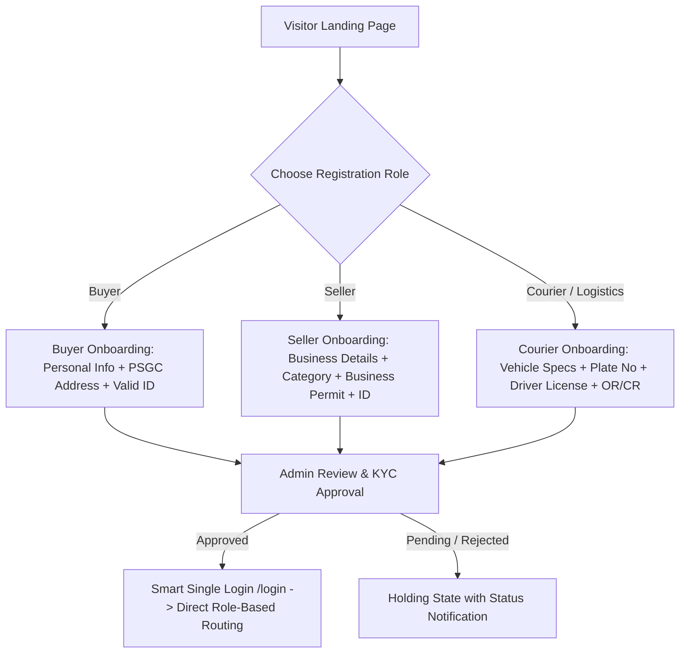
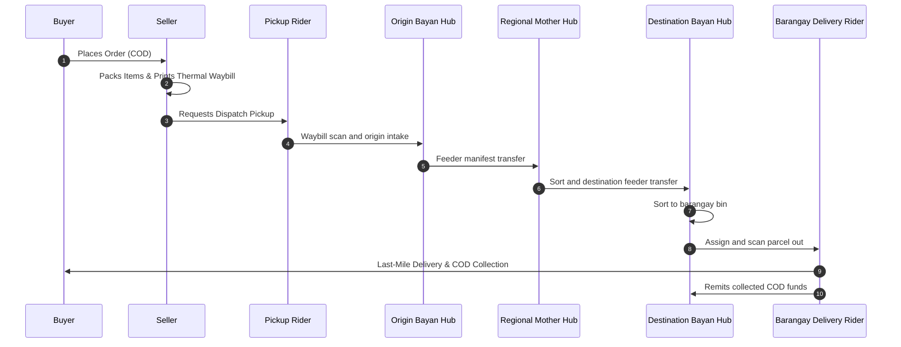
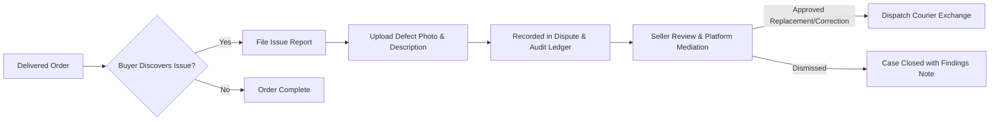

# BagooPH - Master Project Plan & System Architecture

> **Executive Overview:**
> BagooPH ("Bag & Go") is an enterprise multi-role e-commerce and logistics ecosystem built for the Philippine market. It seamlessly interconnects Buyers, Sellers, Logistics Sorting Hubs / Couriers, and Platform Administrators in a single, high-performance architecture.
>
> **Authority:** Strategic overview only. Use `docs/README.md` for the authority map and the normative flow documents for implementation decisions.

---

## 1. Multi-Role Identity & Independent Onboarding


```mermaid
graph TD
    A[Visitor Landing Page] --> B{Choose Registration Role}
    B -->|Buyer| C[Buyer Onboarding: Personal Info + PSGC Address + Valid ID]
    B -->|Seller| D[Seller Onboarding: Business Details + Category + Business Permit + ID]
    B -->|Courier / Logistics| E[Courier Onboarding: Vehicle Specs + Plate No + Driver License + OR/CR]
    
    C --> F[Admin Review & KYC Approval]
    D --> F
    E --> F
    
    F -->|Approved| G[Smart Single Login /login -> Direct Role-Based Routing]
    F -->|Pending / Rejected| H[Holding State with Status Notification]
```

### Key Principles:
1. **Independent Registration Paths:** Sellers can register and operate directly as verified merchants without needing an active buyer account first.
2. **Mandatory KYC Verification:** All roles require administrator document verification before accessing transactional portals.
3. **Unified Login (`/login`):** A single login gateway dynamically routes authenticated sessions to their respective cockpit (`/buyer`, `/seller/dashboard`, `/courier/deliveries`, or `/admin/dashboard`).

---

## 2. Logistics, Sorting Center & GIS Fleet Architecture

The detailed operational authority is `docs/SORTING_CENTER_LOGISTICS_FLOW.md`. This overview must not be used to bypass its custody scans or Mother-Hub route.


```mermaid
sequenceDiagram
    autonumber
    participant Buyer
    participant Seller
    participant PickupRider as Pickup Rider
    participant OriginHub as Origin Bayan Hub
    participant MotherHub as Regional Mother Hub
    participant DestinationHub as Destination Bayan Hub
    participant DeliveryRider as Barangay Delivery Rider

    Buyer->>Seller: Places Order (COD)
    Seller->>Seller: Packs Items & Prints Thermal Waybill
    Seller->>PickupRider: Requests Dispatch Pickup
    PickupRider->>OriginHub: Waybill scan and origin intake
    OriginHub->>MotherHub: Feeder manifest transfer
    MotherHub->>DestinationHub: Sort and destination feeder transfer
    DestinationHub->>DestinationHub: Sort to barangay bin
    DestinationHub->>DeliveryRider: Assign and scan parcel out
    DeliveryRider->>Buyer: Last-Mile Delivery & COD Collection
    DeliveryRider->>DestinationHub: Remits collected COD funds
```

### Sorting Center & Rider Mechanics:
1. **Hub-and-Spoke Delivery Chain:**
   * **Stage 1 (First-Mile):** Pickup rider collects parcels from merchants and transports them to the assigned origin Bayan Hub.
   * **Stage 2 (Regional Sort):** Every parcel passes through at least one Mother Hub before destination distribution.
   * **Stage 3 (Destination Sort):** Destination Bayan Hub sorts parcels by barangay and assigns eligible delivery riders.
   * **Stage 4 (Last-Mile):** Assigned rider scans out, delivers, and records COD custody and proof.
2. **GIS / Proximity-Based Fleet Matching:**
   * Parcels are routed to the nearest operational sorting facility based on geographic coordinates and PSGC address hierarchy.
   * Ensures merchant dispatch connects to the optimal logistics hub in their territory.

---

## 3. Financial Architecture, Fees & Commission Ledger

```
+-------------------------------------------------------------------------------+
|                             TOTAL TRANSACTION VALUE                           |
+------------------------------------+------------------------------------------+
|          PRODUCT SUB-TOTAL         |               SHIPPING FEE               |
+------------------+-----------------+---------------------+--------------------+
| Merchant Payout  | 10% Platform    | Logistics Sorting   | Last-Mile Courier  |
| (90% of Items)   | Commission      | Hub Revenue Share   | Rider Revenue Share|
+------------------+-----------------+---------------------+--------------------+
```

### Fee Calculations & Revenue Sharing:
1. **Platform Commission:** Standard 10% commission automatically deducted from gross product sales and credited to the platform ledger.
2. **Handling & Shipping Fees:**
   * Current checkout uses the configured BagooPH delivery fee rules.
   * Future rate matrices may use package size, weight, and service zone after those inputs are validated.
3. **Shipping Revenue Split:**
   * The collected shipping fee is divided between the Logistics Sorting Hub (operational facility fee) and the Assigned Rider (delivery compensation).
4. **Payment Option:**
   * **Cash on Delivery (COD):** Baseline supported method. Cash custody and reconciliation follow the logistics specification.

---

## 4. Returns, Defects & Issue Reporting Workflow


```mermaid
graph LR
    A[Delivered Order] --> B{Buyer Discovers Issue?}
    B -->|Yes| C[File Issue Report]
    B -->|No| G[Order Complete]
    C --> D[Upload Defect Photo & Description]
    D --> E[Recorded in Dispute & Audit Ledger]
    E --> F[Seller Review & Platform Mediation]
    F -->|Approved Replacement/Correction| I[Dispatch Courier Exchange]
    F -->|Dismissed| H[Case Closed with Findings Note]
```

### Issue Reporting Rules:
1. **Evidence-Based Submission:** Buyers can file formal issue reports directly from their delivered order screen by uploading photos and a structured issue reason (wrong item, damaged packaging, defective unit).
2. **Audit Ledger & Mediation:** All claims are stored in a dedicated dispute ledger accessible by merchants and platform admins to prevent review spam and unverified automated monetary chargebacks.
