# 🏪 Seller (Merchant) Module Specification & Flow

This document details the complete end-to-end workflow, data points, and operational requirements for Sellers.

---

## 📝 1. Seller Registration & Verification

1. **Required Input Fields:**
   - **Personal:** Last Name*, First Name*, Middle Initial, Sex*, Email*, Contact No.*, Birthday*, Age (auto-generated)*.
   - **Address:** Province (Dropdown API), Municipality/City (Dropdown API), Barangay (Dropdown API), Street & House No. (Manual Entry).
   - **Business Profile:** Business Name*, Line of Business (Registered Master Category)*.
   - **Verification Documents:** Upload Government ID*, Upload Valid Business Permit (DTI / Mayor's Permit)*.
2. **State Transition:**
   - Account starts as `pending_approval`.
   - Admin inspects business permit and category alignment.
   - Email dispatch upon approval/disapproval.

---

## 📦 2. Store & Inventory Management

- **Product Catalog Control:**
  - Create, edit, and archive products.
  - Set unit prices, promotional compare prices, stock counts, SKU, and weight.
  - Add product variations (Color, Size, Specification).
  - Category Compliance: Products must strictly belong to the Seller's registered line of business.
- **Promotions & Vouchers:**
  - Create store-exclusive promo vouchers (e.g., 10% off on $50 minimum purchase).

---

## 🏷️ 3. Order Processing & Fulfillment Pipeline

```mermaid
flowchart LR
    NewOrder[New Order Notification] --> ReviewOrder[Review Order Items]
    ReviewOrder --> PackItems[Pack Items & Change Status: Packaging]
    PackItems --> PrintWaybill[Generate & Print Shipping Label / Waybill]
    PrintWaybill --> SchedulePickup[Schedule Courier Pickup]
    SchedulePickup --> Handover[Handover Parcel to Courier at Store]
    Handover --> TrackParcel[Monitor Real-time Shipment Status]
    TrackParcel --> DeliveryDone[Delivery Notification Received]
```

- **Waybill / Shipping Label Specification:**
  - Must include: Order Number, Tracking Barcode/QR, Pickup Store Name & Address, Recipient Name & Phone, Drop-off Address, Payment Mode (e.g. COD Amount to Collect), Special Handling Instructions.

---

## 📊 4. Financial Analytics & Sales Reports

- **Date Filtered Reports:**
  - Dynamic `From Date` and `To Date` selection.
  - Metric 1: **Gross Sales Revenue** ($\sum \text{Orders}$).
  - Metric 2: **Platform Commission** ($10\% \times \text{Subtotal}$).
  - Metric 3: **Net Seller Profit** ($\text{Gross} - \text{Commission}$).
  - Metric 4: Units Sold, Customer Conversion Rate, and Top Selling Inventory items.
- **Customer Feedback Management:**
  - View buyer reviews, ratings, and reply to comments.
