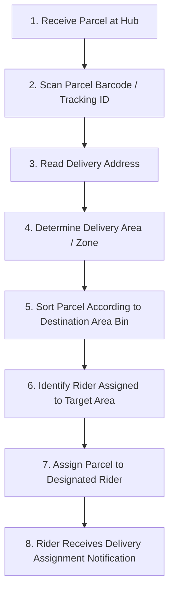

# Sorting Center & Logistics Operational Flow (Partial Plan)

> [!NOTE]
> **Status:** Partial Plan & Theory Specification.
> This document outlines the theoretical operational flow and core responsibilities for the Sorting Center / Logistics module. Additional peripheral processes (admin registration approval, chat/messaging, advanced commission reports, and account settings) are pending final curriculum specifications.

---

## 1. Core Responsibilities of the Sorting Center

The Sorting Center / Logistics Hub acts as the central intake and routing bridge between merchant fulfillment and final-mile doorstep delivery. Its two primary responsibilities are:

1. **Sort Parcels by Destination Area:** Ingest incoming parcels from merchants or pickup couriers and organize them into geographic delivery zones.
2. **Assign Parcels to Designated Area Riders:** Route sorted packages directly to couriers assigned to specific geographic territories.

---

## 2. Step-by-Step Logistics Workflow

### Operational Steps:

1. **Receive Parcel:** Hub intake operators accept physical parcel drops from sellers or first-leg pickup couriers.
2. **Scan Parcel:** The unique thermal tracking barcode or QR code is scanned into the system.
3. **Read Delivery Address:** System parses buyer shipping details (Province, Municipality/City, Barangay).
4. **Determine Delivery Area:** The engine maps the shipping address to its corresponding logistics zone (e.g., Area A, Area B, Area C).
5. **Sort Parcel According to Destination Area:** Physical package is placed in the designated sorting bin/staging shelf for that territory.
6. **Identify Rider Assigned to That Area:** System queries active riders registered/assigned to that specific delivery sector.
7. **Assign Parcel to Rider:** Hub operator or automated routing engine attaches the package to the selected courier's active queue.
8. **Rider Receives Delivery Assignment:** Courier's mobile terminal receives real-time delivery job dispatch with route telemetry.

---

## 3. Example Routing Matrix (Laguna Region)

| Parcel ID | Delivery Address | Delivery Area / Zone | Assigned Rider | Status |
| :--- | :--- | :--- | :--- | :--- |
| **#1001** | Santa Cruz, Laguna | Area A | Rider 01 | Assigned to Rider |
| **#1002** | Pagsanjan, Laguna | Area B | Rider 02 | Assigned to Rider |
| **#1003** | Los Baños, Laguna | Area C | Rider 03 | Assigned to Rider |

---

## 4. Pending / Future Scope (To Be Finalized)

The following components are recognized as part of the broader logistics ecosystem and will be integrated as requirements finalize:

- **Hub & Rider Registration Gate:** Administrative review, KYC verification, and approval/disapproval workflows for logistics hub operators and fleet riders.
- **Cross-Role In-App Messaging:** Real-time chat between hub dispatchers, merchants, riders, and buyers for address clarifications or delivery exceptions.
- **Reporting & Financial Settlements:** Automated generation of transaction logs, commission distribution ledgers, and delivery fee remittance reports.
- **Account & Fleet Management:** Profile maintenance, vehicle status tracking, and zone reassignment.
