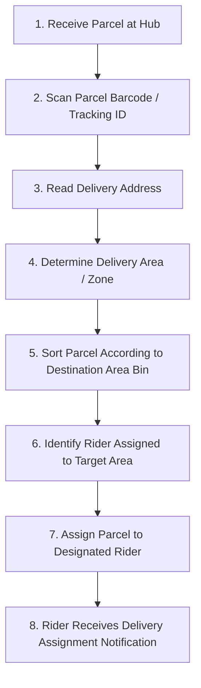

# Sorting Center & Logistics Order and Parcel Flow

> [!NOTE]
> **Status:** Core operational specification.
> This document defines the required buyer, seller, pickup rider, hub, delivery rider, and buyer handovers. Advanced finance, reporting, and optimization modules remain future scope.

## 1. Operational Rule

An order status describes what the customer sees. A delivery checkpoint records the exact physical custody event. Every custody change requires a scan of the parcel waybill barcode or QR code. Typing an order number may be supported as a recovery method, but it must create the same authenticated checkpoint as a scan.

The physical route is always:

```text
Seller -> Pickup Rider -> Origin Bayan Hub -> Mother Hub(s) -> Destination Bayan Hub -> Delivery Rider -> Buyer
```

For a local shipment, unnecessary mother-hub legs may be omitted, but the parcel must still pass through an authorized hub before final-mile delivery. Direct seller-to-buyer delivery is not allowed.

## 2. Core Responsibilities of the Sorting Center

The Sorting Center / Logistics Hub acts as the central intake and routing bridge between merchant fulfillment and final-mile doorstep delivery. Its two primary responsibilities are:

1. **Sort Parcels by Destination Area:** Ingest incoming parcels from merchants or pickup couriers and organize them into geographic delivery zones.
2. **Assign Parcels to Designated Area Riders:** Route sorted packages directly to couriers assigned to specific geographic territories.

---

## 3. End-to-End Product and Waybill Flow

### Stage A: Buyer Places the Order

1. Buyer confirms the delivery address, destination barangay, delivery method, and payment method.
2. Checkout creates the order and reserves/decrements stock atomically.
3. The routing engine resolves the origin Bayan Hub, required mother-hub transfers, and destination Bayan Hub.
4. The buyer and seller see the new order in their respective order pages.

Customer status: `PLACED`.

### Stage B: Seller Confirms, Packs, and Prints the Waybill

1. Seller accepts the order: `PLACED -> CONFIRMED`.
2. Seller prepares and packs the items: `CONFIRMED -> PREPARING`.
3. The system creates one delivery record and unique tracking number for the parcel.
4. Seller prints and attaches the waybill. It must contain the tracking barcode/QR, order number, seller pickup details, buyer destination details, payment method/COD amount, and handling notes.
5. Seller marks the packed parcel ready: `PREPARING -> READY_FOR_PICKUP`.
6. The parcel appears on the pickup riders' available-jobs board. This in-app job-board entry is the baseline notification; email or push notifications are optional enhancements.

### Stage C: Pickup Rider Collects from the Seller

1. An approved and available pickup rider claims the job atomically. A second rider cannot claim it.
2. At the seller, the rider scans the waybill and verifies the parcel against the order number.
3. Seller hands over the parcel and the scan records the rider as the new custodian.
4. Status becomes `PICKED_UP` and a `courier_pickup` checkpoint is recorded.
5. The pickup rider transports the parcel only to its assigned origin Bayan Hub.

### Stage D: Origin Hub Intake

1. Hub handler scans the same waybill at the receiving counter.
2. The system verifies that this is the expected origin hub and that the parcel is currently held by the pickup rider.
3. The scan records hub custody, arrival time, facility code, operator, and tracking number.
4. Customer status becomes `AT_SORTING_CENTER`.
5. The pickup rider's job is complete; the parcel cannot remain in that rider's delivery queue.

### Stage E: Hub-to-Hub Transfer

Hub transfers use outbound and inbound scans. A parcel must never move between facilities through a status-only button.

```text
Origin Bayan Hub
  -> outbound scan onto feeder manifest
  -> inbound scan at Origin Mother Hub
  -> sort scan into destination line-haul cage
  -> outbound scan onto truck manifest
  -> inbound scan at Destination Mother Hub, when required
  -> outbound scan onto destination feeder manifest
  -> inbound scan at Destination Bayan Hub
```

Each transfer records:

- Waybill tracking number.
- Sending and receiving facility codes.
- Manifest number and vehicle when applicable.
- Authenticated scanner/operator.
- Timestamp and custody checkpoint.

The customer-facing order may remain `AT_SORTING_CENTER` during internal hub transfers. Detailed facility progress is shown through tracking checkpoints instead of inventing extra customer statuses.

### Stage F: Destination Sorting and Rider Assignment

1. Destination Bayan Hub scans the parcel inbound.
2. Handler reads the buyer municipality and barangay from the waybill/order.
3. Handler scans or selects the correct barangay bin.
4. Status becomes `SORTED`.
5. The system lists only approved, active, available riders assigned to that hub and barangay.
6. Hub assigns exactly one delivery rider: `SORTED -> ASSIGNED_TO_RIDER`.
7. The assignment appears in that rider's delivery queue. This in-app queue entry is the baseline rider notification.

Sorting and rider assignment are separate events. Sorting alone must not mark a parcel out for delivery.

### Stage G: Final-Mile Dispatch and Delivery

1. Assigned rider scans the waybill while taking custody from the destination hub.
2. The system verifies the rider assignment before allowing dispatch.
3. Status becomes `OUT_FOR_DELIVERY`.
4. Rider delivers to the buyer and records the required proof and delivery notes.
5. Successful handover becomes `DELIVERED`.
6. Only the buyer's receipt confirmation changes `DELIVERED -> COMPLETED`.

### Stage H: Hub Self-Pickup Alternative

For `hub_self_pickup`, the parcel is staged at the destination Bayan Hub instead of assigned to a delivery rider. The buyer receives a claim code/notification and the counter handler verifies the buyer before recording collection. Buyer collection is the delivery event; final completion still follows the documented order completion rule.

### Stage I: Failed Delivery and Return

1. Rider records a required failure reason and returns the parcel to the destination hub.
2. Status becomes `DELIVERY_FAILED`; the parcel cannot remain marked out for delivery.
3. The hub may schedule another attempt and reassign an eligible rider.
4. After three failed attempts, status becomes `RETURNED` and reverse checkpoints route the parcel through the hub network to the seller.

## 4. Sorting Workstation Flow


```mermaid
flowchart TD
    A[1. Receive Parcel at Hub] --> B[2. Scan Parcel Barcode / Tracking ID]
    B --> C[3. Read Delivery Address]
    C --> D[4. Determine Delivery Area / Zone]
    D --> E[5. Sort Parcel According to Destination Area Bin]
    E --> F[6. Identify Rider Assigned to Target Area]
    F --> G[7. Assign Parcel to Designated Rider]
    G --> H[8. Rider Receives Delivery Assignment Notification]
```

### Operational Steps:

1. **Receive Parcel:** Hub intake operators accept physical parcel drops from sellers or first-leg pickup couriers.
2. **Scan Parcel:** The unique thermal tracking barcode or QR code is scanned into the system.
3. **Read Delivery Address:** System parses buyer shipping details (Province, Municipality/City, Barangay).
4. **Determine Delivery Area:** The engine maps the shipping address to its corresponding logistics zone (e.g., Area A, Area B, Area C).
5. **Sort Parcel According to Destination Area:** Physical package is placed in the designated sorting bin/staging shelf for that territory.
6. **Identify Rider Assigned to That Area:** System queries active riders registered/assigned to that specific delivery sector.
7. **Assign Parcel to Rider:** Hub operator or automated routing engine attaches the package to the selected courier's active queue.
8. **Rider Receives Delivery Assignment:** Courier's mobile terminal receives real-time delivery job dispatch with route telemetry.

---

## 5. Example Routing Matrix (Laguna Region)

| Parcel ID | Delivery Address | Delivery Area / Zone | Assigned Rider | Status |
| :--- | :--- | :--- | :--- | :--- |
| **#1001** | Santa Cruz, Laguna | Area A | Rider 01 | Assigned to Rider |
| **#1002** | Pagsanjan, Laguna | Area B | Rider 02 | Assigned to Rider |
| **#1003** | Los Baños, Laguna | Area C | Rider 03 | Assigned to Rider |

---

## 6. Required Authorization and Validation

- Sellers can act only on orders containing items from their shop.
- Pickup jobs can be claimed only while the parcel is `READY_FOR_PICKUP` and unclaimed.
- Hub handlers can scan only at their assigned facility; company administrators may operate across facilities they manage.
- An intake scan must match the parcel's expected next facility.
- A final-mile rider must be approved, active, available, assigned to the destination hub, and compatible with the destination barangay.
- Only the assigned final-mile rider may scan a parcel out for delivery or submit its delivery result.
- Duplicate scans must be idempotent and must not create duplicate custody changes.
- Cancelled, completed, or returned parcels cannot re-enter active dispatch.

## 7. Pending / Future Scope

The following components are recognized as part of the broader logistics ecosystem and will be integrated as requirements finalize:

- **Hub & Rider Registration Gate:** Administrative review, KYC verification, and approval/disapproval workflows for logistics hub operators and fleet riders.
- **Cross-Role In-App Messaging:** Real-time chat between hub dispatchers, merchants, riders, and buyers for address clarifications or delivery exceptions.
- **Reporting & Financial Settlements:** Automated generation of transaction logs, commission distribution ledgers, and delivery fee remittance reports.
- **Account & Fleet Management:** Profile maintenance, vehicle status tracking, and zone reassignment.
